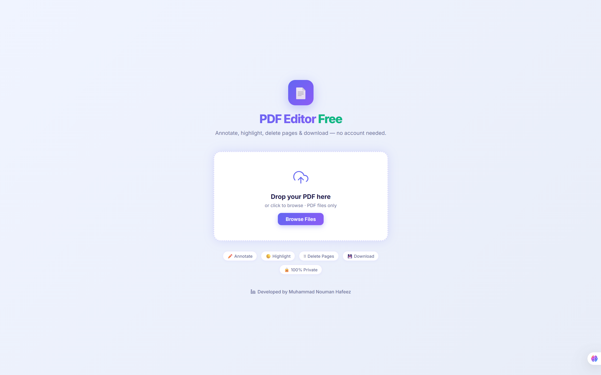
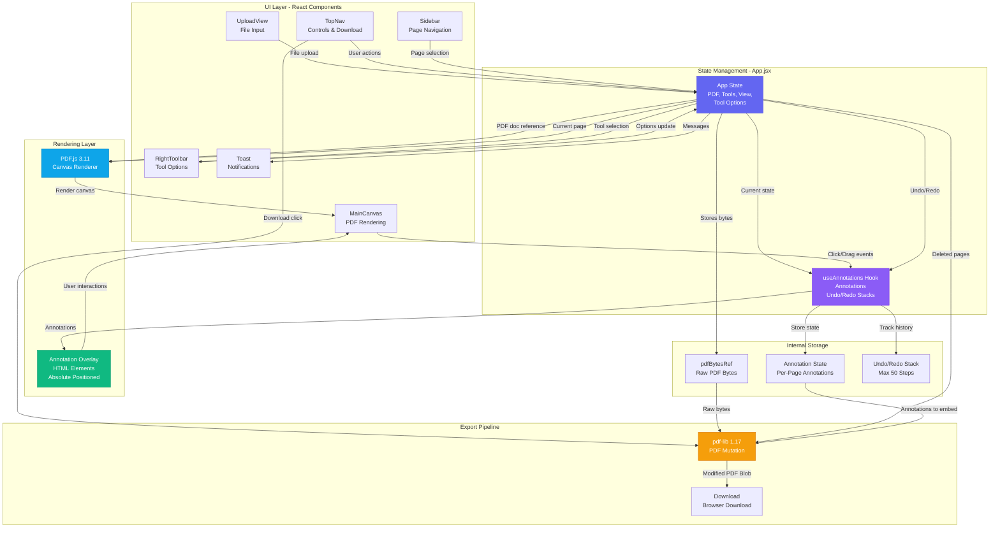

# PDF Editor Free 📄✨

A fast, production-ready, client-side-only PDF editor built with **React**, **Vite**, **PDF.js**, and **pdf-lib**. Edit PDFs instantly in your browser without ever uploading to a server.

<p align="center">
  
</p>


🚀 **[Live Demo](https://pdf-editor-lac-alpha.vercel.app)**

## Features

### ✨ Annotation & Drawing Tools

- **Add Text:** Insert custom text with configurable font family, size, and color
- **Highlight Areas:** Apply semi-transparent highlights in multiple colors (Yellow, Green, Blue, Pink)
- **Draw Rectangles:** Add colored rectangular annotations (Indigo, Sky, Red, Emerald)
- **Eraser Tool:** Remove individual annotations from pages

### 📄 Page Management

- **Delete Single Pages:** Click to remove individual pages from the PDF
- **Delete Page Ranges:** Bulk delete a range of pages with a dedicated range selector
- **Page Thumbnails:** Visual sidebar with page previews and quick page navigation
- **Page Counter:** Real-time display of active vs. total pages

### 🎨 Viewing Controls

- **Zoom In/Out:** Scale from 30% to 250% with 15% increments
- **Fit to Width:** Auto-fit current page width to viewport
- **Rotate Pages:** Rotate visual view 90° left or right (0°, 90°, 180°, 270°)
- **Mobile Responsive:** Optimized layouts for all screen sizes with collapsible sidebar

### 💾 Undo/Redo System

- **Robust Undo/Redo Stack:** Up to 50 steps of history (Ctrl+Z / Ctrl+Y)
- **Per-Page Annotations:** Track changes independently for each page
- **Full State Recovery:** Restore complete editing state or revert to previous versions

### 🔒 Privacy & Performance

- **100% Client-Side Processing:** Your files never leave your device or contact a server
- **Instant Export:** Download modified PDFs immediately without server roundtrips
- **Secure Annotation Embedding:** Annotations are permanently embedded into the PDF without metadata
- **Optimized PDF Output:** Exports clean, compressed PDFs with removed pages and embedded annotations

### 🎯 User Experience

- **Beautiful Light Theme:** Modern interface with indigo and glassmorphism design accents
- **Toast Notifications:** Visual feedback for user actions (file loaded, download complete, etc.)
- **Keyboard Shortcuts:** Ctrl+Z (Undo), Ctrl+Y (Redo)
- **Accessibility:** ARIA labels on all interactive elements
- **Select & Move Tool:** Click annotations to reposition them on the page

## Tech Stack

- **React 18.3** — UI framework with hooks (useState, useRef, useCallback, useEffect)
- **Vite 5.4** — Lightning-fast build tool and dev server
- **PDF.js 3.11** — Render PDF pages to canvas with proper viewport handling
- **pdf-lib 1.17** — Mutate PDFs: embed annotations, remove pages, export files
- **CSS3** — Grid/Flexbox layouts, animations, responsive design

## Getting Started

### Installation

```bash
npm install
```

### Development

```bash
npm run dev
```

Open [http://localhost:5173/](http://localhost:5173/) in your browser.

### Production Build

```bash
npm run build
```

### Preview Build Output

```bash
npm run preview
```

## Project Structure

```
src/
├── App.jsx                    # Main app orchestrator (state management, handlers)
├── index.css                  # Global theme variables, animations, responsive utilities
├── main.jsx                   # React DOM render entry point
├── components/
│   ├── MainCanvas.jsx         # PDF canvas + annotation layer interaction
│   ├── TopNav.jsx             # Header with zoom, rotate, undo/redo, download controls
│   ├── Sidebar.jsx            # Left sidebar with page thumbnails and delete range tool
│   ├── RightToolbar.jsx       # Tool selector + color/font options
│   ├── Thumbnail.jsx          # Individual page thumbnail with delete button
│   ├── UploadView.jsx         # Initial file upload UI
│   ├── Toast.jsx              # Toast notification component
│   └── Icons.jsx              # SVG icon components used throughout
├── hooks/
│   ├── useAnnotations.js      # Manages annotation state, undo/redo stacks per page
│   └── usePdfDownload.js      # Builds final PDF: embeds annotations, removes pages
└── utils/
    └── colorUtils.js          # Hex to RGB conversion utilities
```

## Architecture & How It Works

### System Architecture Diagram



### 1. **PDF Loading**

- User uploads a PDF file via `UploadView.jsx`
- PDF.js loads the file and creates a document reference
- The raw `ArrayBuffer` is cloned and stored separately because PDF.js web workers detach buffers
- Original bytes are preserved in `pdfBytesRef` for later export

### 2. **State Management**

- **PDF State:** `pdfDoc`, `fileName`, `currentPage`, `totalPages`, `deletedPages`, page dimensions
- **Annotation State:** `useAnnotations()` hook manages per-page annotations, undo/redo stacks
- **Editing State:** Active tool (`select`, `text`, `highlight`, `rectangle`, `eraser`), options (colors, font)
- **View State:** Zoom level, rotation angle, sidebar visibility, mobile responsive state

### 3. **Annotation Layers**

- PDF.js canvas renders to `<canvas>` element at the current zoom/rotation
- A transparent overlay `<div>` sits on top with absolute-positioned annotation elements
- Click handlers on overlays detect hits and allow editing/deletion
- Annotations are stored in React state (not embedded in PDF yet)

### 4. **User Interactions**

- **Text Tool:** Click to place text, type inline, embed text color/font options
- **Highlight & Rectangle:** Click + drag to draw, release to finalize, click to select/resize
- **Eraser Tool:** Click annotations to remove them
- **Select Tool:** Click annotations to move them or delete via backspace
- **Page Delete:** Click thumbnail delete icon or use range selector

### 5. **Export Pipeline** (in `usePdfDownload.js`)

- Get raw PDF bytes from `pdfBytesRef`
- Use `pdf-lib` to load the PDF document
- Embed each annotation into the PDF tree (text, rectangles, highlights)
- Remove deleted pages from the document
- Export optimized PDF Blob
- Trigger browser download

### 6. **Undo/Redo System**

- Each annotation mutation pushes the previous state onto `undoStack`
- Max 50 items to limit memory usage
- Redo stack clears when new edits occur
- Per-page annotation isolation prevents cross-page undo conflicts

## Features Breakdown by Component

### **App.jsx** (Main Orchestrator)

- Manages 50+ pieces of state (PDF, view, tools, annotations, etc.)
- Handles keyboard shortcuts (Ctrl+Z, Ctrl+Y)
- Passes state and handlers to child components
- Orchestrates PDF loading and download flows

### **MainCanvas.jsx** (Editing Surface)

- Renders PDF.js canvas at current zoom/rotation
- Overlay layer with annotation rendering
- Hit-testing for annotation selection
- Drag handlers for drawing and moving annotations

### **TopNav.jsx** (Header Controls)

- Branding and file name display
- Undo/Redo buttons with state indicators
- Zoom in/out/fit controls with percentage display
- Rotate left/right buttons
- Open new PDF and Download buttons with loading states

### **Sidebar.jsx** + **Thumbnail.jsx** (Page Navigation)

- Scrollable page thumbnails with quick navigation
- Delete range panel for bulk page removal
- Visual page counter (active/total)
- Responsive collapse on mobile

### **RightToolbar.jsx** (Tool Options)

- Tool selector buttons (5 tools: select, text, highlight, rectangle, eraser)
- Dynamic option panels:
  - **Text Tool:** Font family dropdown, font size dropdown, color picker
  - **Highlight:** Color swatches (4 preset colors)
  - **Rectangle:** Color swatches (4 preset colors)

### **UploadView.jsx** (File Upload)

- Large drop zone for file uploads
- File input with PDF MIME type restriction
- Drag-and-drop support

### **Toast.jsx** (Notifications)

- Success/error/info toast messages
- Auto-dismiss after 3 seconds
- Smooth fade animations

## Configuration

### Vite Setup

- Uses `@vitejs/plugin-react` for JSX transformation
- `optimizeDeps` pre-bundles `pdfjs-dist` and `pdf-lib` for faster builds

### PDF.js Web Worker

- PDF.js automatically uses the bundled worker from `node_modules/pdfjs-dist/build/pdf.worker.js`
- Vite handles this transparently

## CI/CD & Deployment

This project uses **GitHub Actions** to automatically build and deploy to Vercel:

1. **Trigger:** Any push or merge to the `main` branch
2. **Build:** Runs `npm run build` to generate optimized static files
3. **Deploy:** Vercel receives the build output and deploys to production

### Self-Hosting Steps

1. Fork or clone this repository
2. Link repo to your Vercel account (or alternative hosting)
3. Ensure the builder recognizes it as a **Vite** project
4. Any pushes to `main` will auto-deploy

### Environment

- Node.js 16+ (Vite requirement)
- Modern browsers with ES2020+ support
- No backend/server required

## Performance Optimizations

- **Lazy PDF.js Loading:** Worker threads loaded on-demand
- **Canvas Rendering:** High-DPI canvas scaling for sharp renders
- **State Isolation:** Annotations per-page prevent unnecessary re-renders
- **Memory Management:** 50-step undo/redo limit prevents unbounded growth
- **Optimized Export:** PDF.js handles compression during export

## Browser Support

- Chrome/Edge 90+
- Firefox 88+
- Safari 14+
- Mobile browsers (iOS Safari 14+, Android Chrome)

## Troubleshooting

**PDF not rendering?**

- Ensure the PDF file is not corrupted
- Check browser console for PDF.js errors

**Annotations not saving?**

- Use the Download button to embed and save annotations
- Refreshing the page will lose unsaved annotations (intentional: client-side only)

**Performance slow?**

- Reduce zoom level or close unnecessary browser tabs
- Large PDFs (100+ pages) may require more memory

---

**Developed by [Muhammad Nouman Hafeez](https://www.linkedin.com/in/noumanic)**

Licensed under MIT. Free to use, modify, and distribute.
